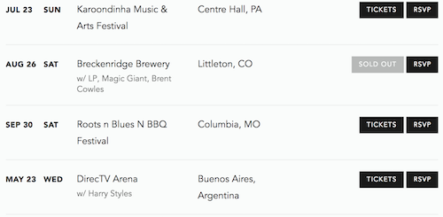

# Artist Website

##### You're going to create a website for your favorite band or artist. Once you've chosen a band and/or artist, make sure to check out their real website for ideas.

##### Check out some examples here:
* [Taylor Swift](https://taylorswift.com/) <-- lots of hover action
* [Bruno Mars](http://www.brunomars.com/) <-- is that a background video?
* [Sam Hunt](http://www.samhunt.com/) <-- checkout that fadeIn()
* [Leon Bridges](http://leonbridges.com/) <-- parallax image and cool nav bar

## Look at what was given to you...
* You have three HTML files `home.html`, `tour-dates.html`, `merchandise.html`
* You have a `style.css` that is already linked to all of your HTML files using: `<link rel="stylesheet" type="text/css" href="style.css">` in the `<head>` tag
* jQuery is linked in the `<head>` of ALL of your HTML pages using: `<script src="https://ajax.googleapis.com/ajax/libs/jquery/3.2.1/jquery.min.js"></script>` in the `<head>` tags
* You have a `script.js` that is already linked in all of your HTML files using: `<script type="text/javascript" src="script.js"></script>` in the `<head>` tags
* There is a navigation bar in `home.html` that has some styles prewritten for you. Click on the links to make sure they are working properly. You will probably want to add more styling as you continue to build your website.

_____________________________________________________________________________
## LEVEL ONE

### Home Page in `home.html`
* Change WEBSITE NAME to say something better
* Add a [heading](https://www.w3schools.com/html/html_headings.asp) to your website
* Add a brief bio for the band and/or artist using a `<p>` tag.
* Add the band/artist's most recent music video using the [`<iframe>` tag](https://www.w3schools.com/tags/tag_iframe.asp)
* Add [`<a>` tags](https://www.w3schools.com/tags/tag_a.asp) to the band/artist on soundcloud, spotify, youtube, or vimeo
* Put an `id` on the `<body>`. See below for an example
  ``` HTML
  <body id="home-body">
    ...
  </body>
  ```
* In `style.css` select the `id` to add a [background color](https://www.w3schools.com/cssref/pr_background-color.asp)

### Tour Dates Page in `tour-dates.html`
* Make a table using the HTML [`<table>` tag](https://www.w3schools.com/html/html_tables.asp) that shows the band/artist's concert schedule
* Add a 'tickets' button to each tour date. Here is a good example: 
. 
* You will need to use the [`<button>` tag](https://www.w3schools.com/tags/tag_button.asp)


### Merchandise Page in `merchandise.html`
* Add at least 4 images of merchandise that the band sells

_____________________________________________________________________________
## LEVEL TWO

### Home Page
* Try changing your background color to be a [linear-gradient()](https://developer.mozilla.org/en-US/docs/Web/CSS/linear-gradient) instead of one solid color
* Add a [google font](https://fonts.google.com/) to your page.
  * Click on the red plus sign of the font you want to use
  * Click on the black bar at the bottom of the page that says 1 Family Selected
  * Copy the `<link>` and put it inside the `<head>` tag in your HTML file
  * Follow the font-family instructions for your CSS

* Change the color of the text on your page


### Tour Dates Page
* Style your tickets buttons to look better. Here are some CSS properties you will probably want to use:
  * `background-color`
  * `border-radius`
  * `padding`
  * `color`
  * `border`
  * `box-shadow`
* When the user clicks on the tickets button bring them to a website where they can buy tickets. HINT: you can do this using an `<a>` tag inside the `<button>` tag. See below...
  ``` HTML
  <button><a href="link_goes_here"></a></button>
  ```
* Add a [`hover` effect](https://www.w3schools.com/cssref/sel_hover.asp) to the buttons on your tour dates table, so that when you hover on the ticket buttons some of the colors change. (or something else changes!)

_____________________________________________________________________________
## LEVEL THREE

### Home Page
* In `script.js` select the nav bar by it's `id` using jQuery and save it in a variable called `navBar`. It will look something like this 
  ` var exampleSelect = $("#example-id"); `
* Make your navigation bar slowly fade in when the page loads. Hint: you will need to use the jQuery [fadeIn() function](http://api.jquery.com/fadein/). Google it if you forget how it works.
* Get rid of the underlines on the link tags in your navigation. Google "how to remove underlines from link tags with CSS"

### Tour Dates Page
* Create a secret spot on the page. When the user clicks on it, they will be alerted that they won backstage passes to the next show! Follow the steps below:
  * Create a new HTML element to be clicked or decide which old HTML element you would like to use. Add an id to the element so that it is easy to select using jQuery.
  * Select your element in `script.js` using jQuery and save it in a variable.
    * ``` var exampleVariable = $("#example-class"); ```
  * Call the [click() jQuery function](https://api.jquery.com/click/) on your variable. 
  * When the user clicks on the secret spot use the [alert() function](https://www.w3schools.com/jsref/met_win_alert.asp) to create a pop up saying the user has won back stage passes 

_____________________________________________________________________________
## LEVEL FOUR

### Merchandise Page
* Add a parallax image to your page. [See an example here](https://www.w3schools.com/howto/howto_css_parallax.asp)

### Other ideas
* Add a [slide show](https://www.w3schools.com/howto/howto_js_slideshow.asp) of images to one of the pages.
* Try to use spotify or soundcloud to embed a song on one of the pages

### CREATE!
* Use your creativity to make your website even more awesome!
